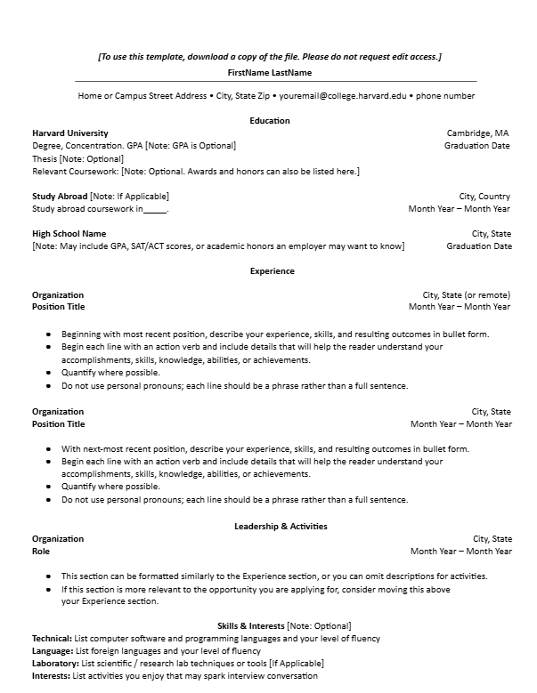
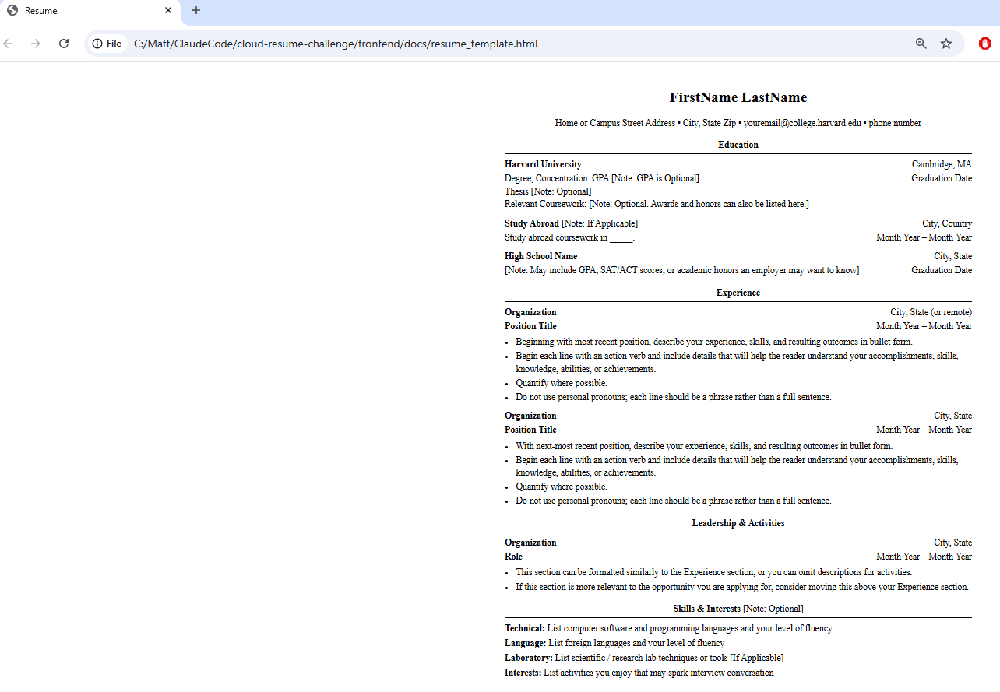

# Frontend Technical Specification

- Create a static website that serves an html resume.

## Resume Format Considerations

I live in the USA. I am not aware of any necessary omissions to comply with discrimination laws. I'm going to use the [Harvard Resume Template format](https://careerservices.fas.harvard.edu/resources/bullet-point-resume-template/) as the basis of my resume.

### Harvest Resume Format Generation
I'm going to let AI do the heavy lifting and generate out the HTML and possibly CSS and from there I will manually refactor the code to preferred standard.

Prompt to Claude:

'''Convert this resume format into html. Please don't use a css framework.
Please use the least amount of css tags
'''

This is the [generated output](./docs/resume_template.html) which I will refactor.

This is what the generated HTML looks like unaltered:

## HTML Adjustments

- UTF8 will support most languages, I plan to use English alone - this metatag stays.
- Because we will be applying mobile styling to our website, we'll include the viewport metatag width=device-width so mobile styling scales normally.
- We'll extract our styles into its own stylesheet after we're happy with our HTML markup
- We'll simplify our HTML markup css selectors to be as minimal as possible